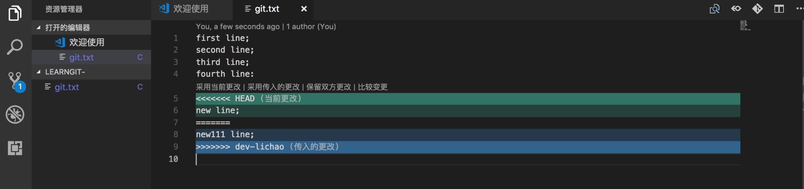
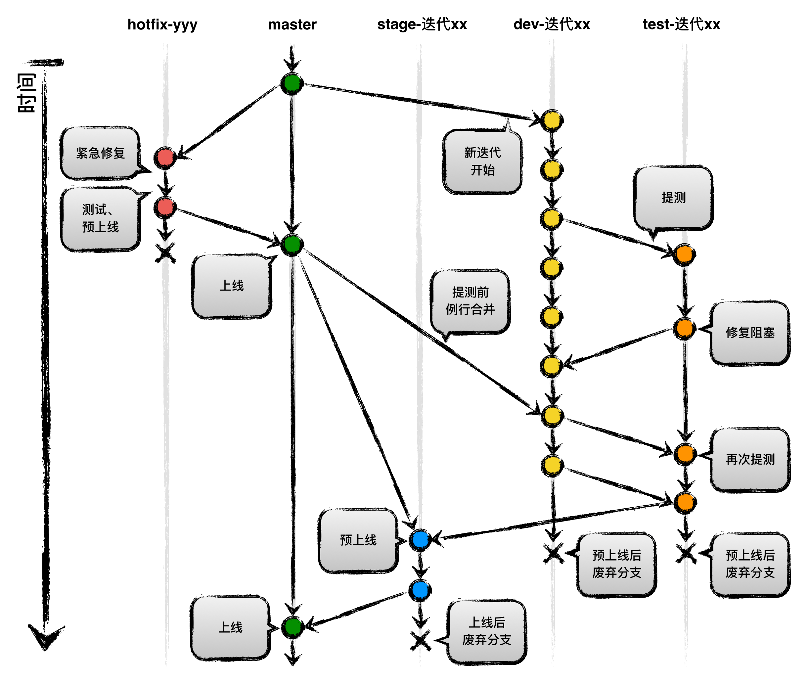

# 分支管理

#### 1）创建与合并分支

```
$ git checkout -b dev             //创建dev分支，然后切换到dev分支  -b表示创建并切换
$ git branch                      //列出所有的分支，可以查看当前分支
$ git add file
$ git commit -m "xxx"             //在dev分支上正常提交，
$ git checkout master
$ git merge dev                   //把dev分支的工作合并到master分支上
$ git branch -d dev               //合并完成后，可以删除dev分支了 

```

通常，合并分支的时候，git会使用fast forward模式（看不出来曾经做过的合并），在这种模式下，删除分支后，会丢掉分支信息，使用--no-ff的方式git merge，使用普通模式合并，合并后的历史有分支，能够看出来曾经做过合并，在分支中，master分支应该是非常稳定的，也就是仅仅用来发布新的版本的，不能在上面工作，

```
$ git checkout -b dev
$ git add readme.txt 
$ git commit -m "add merge"
$ git checkout master
$ git merge --no-ff -m "merge with no-ff" dev
```

bug分支: 修复bug时，我们通过创建一个新的bug分支，然后合并，最后删除，当手头工作没有完成时，先把工作现场stash一下，然后去修复bug，再Git stash pop，回到工作现场。

```
$ git stash          //把当前工作现场”储藏起来“，等以后恢复现场后再继续工作
$ git stash list     //查看工作区
$ git stash apply    //恢复，恢复后，stash的内容并没有删除，需要使用git drop来删除。 还可以直接使用git stash pop
$ git drop           //删除
$ git stash pop      //恢复暂存的分支
```

Feature分支:在软件开发中，总有新的功能需要不断的添加进来，每添加一个新的功能，最好新建一个feature分支，在上面开发，完成后合并，最后，删除该feature分支。如果要丢弃一个没有被合并过的分支，可以通过git branch -D <name>强行删除。

#### 2）解决冲突

当git无法自动合并分支时，必须首先解决冲突，再提交，合并完成。git status告诉我们冲突的文件，Git用<<<<<<<，=======，>>>>>>>标记出不同分支的内容，修改后保存，使用git log --graph命令可以看到分支合并图，然后在提交，最后删除分支。



#### 3）多人协作

分支是否推送到远程？

1. master分支是主分支，因此要时刻与远程同步。
2. dev分支是开发分支，团队所有成员都需要在上面工作，所以也需要与远程同步。
3. bug分支只用于在本地修复bug，就没有必要推送到远程。
4. feature分支是否推送到远程，取决于你是否和小伙伴合作在上面开发。

  多人协作的工作模式通常是如下：

1. 首先，用git push origin <branch-name>推送自己的修改；
2. 如果推送失败，则因为远程分支比你的本地更新，需要先用git pull试图合并；
3. 如果合并有冲突，则解决冲突，并在本地提交；
4. 没有冲突或者解决掉冲突后，再用git push origin <branch-name>推送就能成功！

​           如果git pull提示no tracking information，则说明本地分支和远程分支的链接关系没有创建，用命令git branch --set-upstream-to <branch-name> origin/<branch-name>。

rebase操作

多人在同一个分支上协作的时候，很容易出现冲突，即使没有冲突，后push的同学也得先pull，在本地合并，然后才能push成功。

rebase操作的特点：把分叉的提交历史整理成一条直线，看上去更加的直观，缺点是本地的分叉提交已经被修改过。

#### 4）创建标签

1.首先切换到需要打标签的分支上。

 2.然后，git tag <name>就可以打一个新的标签。使用git tag 可以查看所有的标签

#### 5)



