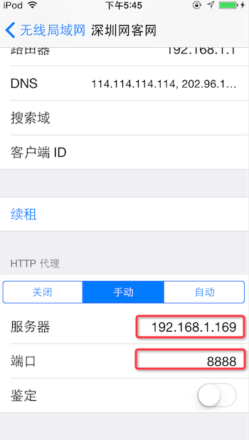

1、PPT附件

2、charles抓包

2.1、charles 安装

下载： https://www.charlesproxy.com/download/

2.2、HTTP抓包

（1）查看电脑IP地址

（2）设置手机HTTP代理

手机连上电脑，点击“设置->无线局域网->连接的WiFi”，设置HTTP代理：服务器为电脑IP地址：如192.168.1.169端口：8888

设置代理后，需要在电脑上打开Charles才能上网

（3）电脑上打开Charles进行HTTP抓包

手机上打开某个App或者浏览器什么的，如果不能上网，检查前面步骤是否正确

点击“Allow”允许，出现手机的HTTP请求列表

2.3. HTTPS抓包

HTTPS的抓包需要在HTTP抓包基础上再进行设置

设置前抓包HTTPS是这样的

设置后抓包HTTPS长这样

（1）安装SSL证书到手机设备

点击 Help -> SSL Proxying -> Install Charles Root Certificate on a Mobile Device

出现弹窗得到地址 chls.pro/ssl

在手机Safari浏览器输入地址 chls.pro/ssl，出现证书安装页面，点击安装  手机设置有密码的输入密码进行安装

注意1：有兄弟姐妹说Safari浏览器输入这个网址chls.pro/ssl安装不了证书的情况,亲测要(1)设置好手机HTTP代理 (2)电脑上Charles要开着

注意2：iOS 10.3系统，需要在 设置→通用→关于本机→证书信任设置 里面启用完全信任Charles证书

（2）Charles设置Proxy

  Proxy -> SSL Proxying Settings...

勾选Enable SSL Proxying,点击Add

Host设置要抓取的https接口，比如想抓这个

Host填写：https://api.weibo.cn

Port填写：443

（3）进行HTTPS抓包

重新发送https请求，可看到抓包

注意：不抓包请关闭手机HTTP代理，否则断开与电脑连接后会连不上网

4、本地调试

host管理工具：Gas Mask

代理本地ip到指定域名

