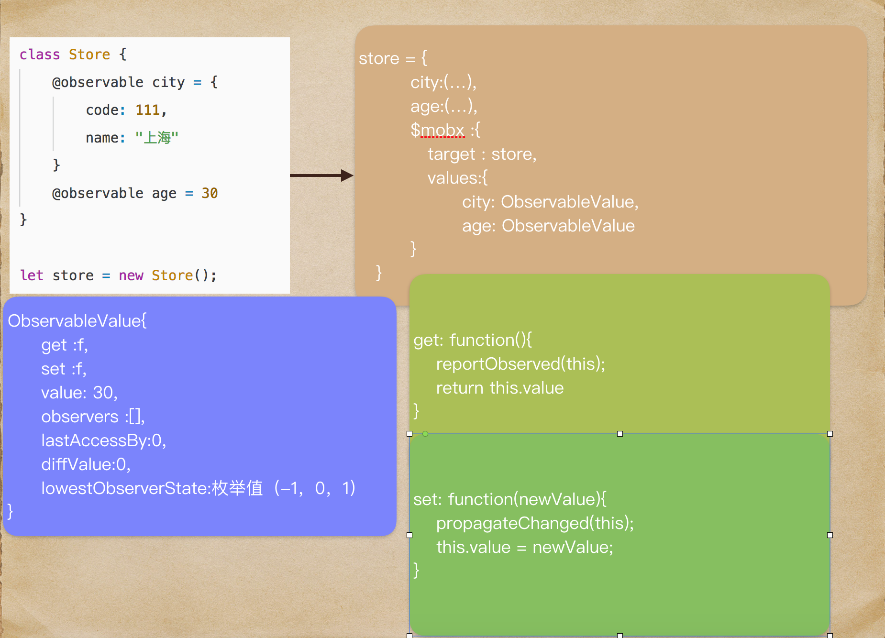
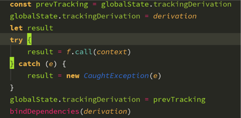

1、@observable  autorun的表现

observable 劫持对象属性，通过  Object.defineProperty 添加 getter和setter 访问器。实现对数据的拦截。

autorun 接收一个回调函数，回调函数依赖可观察的数据。在依赖的数据变更时，自动触发回调函数的运行。


2、观察者模式

被观察对象：@observable   ---->  Object.defineProperty劫持getter，setter，创建数据的访问代理 

观察者：autoRun(fn) 内部创建 ---->  执行autoRun创建Reaction(观察者)，然后调用fn访问observable数据，触发数据getter调用，在数据的代理对象上保存当前观察者(Reaction)。

通知：observable数据发生变更，触发setter调用，触发代理对象上保存的观察者们(Reactions)去调用fn。

3、数据劫持

4、观察者


5、全局对象

```javascript
globalState={

    trackingDerivation: null, // 当前的观察者reaction 

    pendingReactions: [], // 当前需要处理的 reactions,

    inBatch: 0,

 runId: 0,

 isRunningReactions: false,

}
```

reaction和observableValue都可以访问，是他们建立联系的桥梁。

6、整体流程分析

1、文件加载时，@observable装饰器执行，为数据添加劫持（见3数据劫持图片）

2、autorun执行

（1）、生成观察者对象reaction。

（2）、执行reaction.schedule(), 经过一些方法的调用，就会执行track,调用autorun传入的fn，进入下一步。



3、数据劫持

执行fn，访问数据，调用ObservableValue.get()，执行reportObserved(this);


4、bindDependencies(derivation)    

derivation --> reaction观察者    把reaction push到observableValue.observers里


附录：mobx中的批处理 （batch）

（仅列出调用栈执行顺序,供研读了mobx代码的同学参考）

上下缩进不同代表A(前)函数调用了B(后)函数（不严格，不一定是A直接调用B，可能是间接）

上下缩进相同代表A、B函数顺序调用

例子：

-----文件加载执行autorun-----

     autorun 

	  schedule   push(reaction)

		global.runReactions 

			 isRunningReactions = true

   			 runReaction

			      startBatch  +1

                               track

				   startBatch +1 

				   fn()  setter

					     startBatch +1

                                                 observers.length=0

					     endBatch -1

				   bindDependencies();  //observableValue.observers.push(reaction)

                			   endBatch -1

			      endBatch -1

				     global.runReactions 

			 isRunningReactions = false

-----3s以后定时器执行改变-----

  setTimeout       setter

				startBatch +1

                		        schedule push(reaction)

               		        endBatch -1

                      			global.runReactions 


